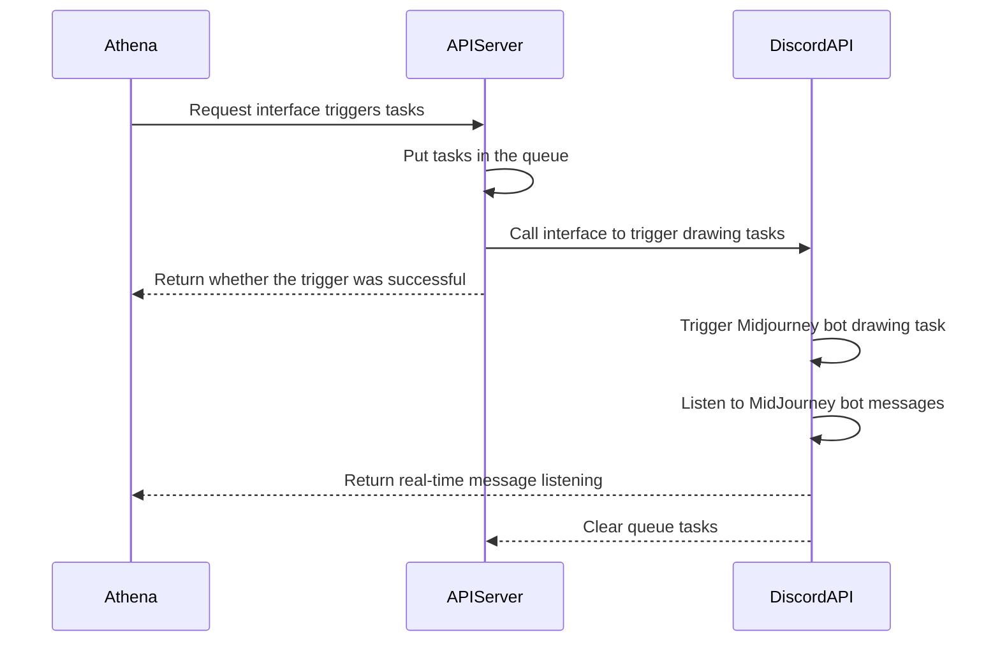

# Athena Backend

**Based on Discord, the Midjourney API.**

**Add Midjourney banned words entry [issue](https://github.com/yokonsan/midjourney-api/issues/new?assignees=&labels=banned+prompt&projects=&template=banned_prompt_report.yml&title=Banned+prompt%3A+)**

## UML



## Usage Conditions

1. Ensure the program startup environment can access Discord.
2. Have Midjourney and Discord accounts.
3. Create a Discord channel and add a bot, refer to the tutorial [Midjourney｜ How to integrate into your platform](https://mp.weixin.qq.com/s?__biz=Mzg4MjkzMzc1Mg==&mid=2247484029&idx=1&sn=d3c458bba9459f19f05d13ab23f5f67e&chksm=cf4e68eaf839e1fc2db025bd9940d0f5e57862f1788c88215b4a66cb23f553a30c5f37ac3ae8&token=79614426&lang=zh_CN#rd)

## Installation and Start

```bash
git clone
pip install -r requirements.txt
python3 get_aws_secrets.py
```

This will Rename the file `.env.template` to `.env` and fill in the parameter values:

```
USER_TOKEN=User token
BOT_TOKEN=Bot token
GUILD_ID=Server ID
CHANNEL_ID=Channel ID
CALLBACK_URL=Callback URL, default http post request, used to receive midjourney drawing progress and results
```

### Start directly

```bash
make run-all
# Check out makefile for more instructions

```

#### Update

```bash
git pull

```

Interface `swagger`documentation：[http://127.0.0.1:8062/docs](http://127.0.0.1:8062/docs)

`midjourney-api`  provides interfaces:

- [X] `/v1/api/trigger/imagine`：Trigger drawing task (image-to-image, add the image link before the Prompt)
- [X] `/v1/api/trigger/upscale`：U
- [X] `/v1/api/trigger/variation`：V
- [X] `/v1/api/trigger/solo_variation`：Make Variations
- [X] `/v1/api/trigger/solo_low_variation`：Vary(Subtle)
- [X] `/v1/api/trigger/solo_high_variation`：Vary(Strong)
- [X] `/v1/api/trigger/zoomout`：Zoom Out 2x/1.5x
- [X] `/v1/api/trigger/expand`：⬅️ ➡️ ⬆️ ⬇️
- [X] `/v1/api/trigger/reset`：Redraw
- [X] `/v1/api/trigger/upload`：Upload image
- [X] `/v1/api/trigger/describe`： Generate Prompt by uploading image name
- [X] `/v1/api/trigger/message`：Send image message, return image link for image-to-image functionality

## Use

### imagine

Text-to-image

```bash
curl -X 'POST' \
  'http://127.0.0.1:8062/v1/api/trigger/imagine' \
  -H 'accept: application/json' \
  -H 'Content-Type: application/json' \
  -d '{
  "prompt": "a cute cat",
  "extra": "--ar 9:16"
}'
```

Image-to-image, needs to include the image URL

```bash
curl -X 'POST' \
  'http://127.0.0.1:8062/v1/api/trigger/imagine' \
  -H 'accept: application/json' \
  -H 'Content-Type: application/json' \
  -d '{
  "prompt": "a cute cat",
  "extra": "--ar 9:16",
  "picurl": "https://xxxxxx/xxxxxxxxxxxx.jpg"
}'
```

- #### Extra
- if extra parameters are necessary for the image that you require,
- Input them in the `extra` section
- *** eg -> "extra": "--ar 9:16", OR "extra": "--ar 1:1",***

### upscale

```bash
curl -X 'POST' \
  'http://127.0.0.1:8062/v1/api/trigger/upscale' \
  -H 'accept: application/json' \
  -H 'Content-Type: application/json' \
  -d '{
  "index": 1,
  "msg_id": "xxxxxxxxxx",
  "msg_hash": "xxxxx-xxx-xxxx-xxxx-xxxxxx",
  "trigger_id": "xxxxxxxxxx"
}'
```

- #### Precautions
- ***make sure that msg_id, msg_hash & trigger_id is of the right message (msg will be a 4 img panel which have U1, U2, U3, U4)***
- ***to get the msg_id & msg_hash, get the trigger_id of respective message from the bot message***
- eg -> if bot return `string <#1234567890#>world of warcraft in pink` => the trigger_id is 1234567890
- ***once you have trigger_id, use the getmessage endpoint and input the trigger_id to get respective msg info***
- #### Parameters
- `index`: Image index, possible values: 1, 2, 3, 4
- `msg_id`: Callback message `id` field after the completion of the drawing in the `imagine` process
- `msg_hash`: Extracted from the callback message after the completion of the drawing in the `imagine` process. It is obtained by splitting the filename in `attachments[0]` and taking the last part before the extension.
- `trigger_id`: Callback message `trigger_id` field after the completion of the drawing in the `imagine` process

### variation

```bash
curl -X 'POST' \
  'http://127.0.0.1:8062/v1/api/trigger/variation' \
  -H 'accept: application/json' \
  -H 'Content-Type: application/json' \
  -d '{
  "index": 2,
  "msg_id": "xxxxxxxxxx",
  "msg_hash": "xxxxx-xxx-xxxx-xxxx-xxxxxx",
  "trigger_id": "xxxxxxxxxx"
}'
```

### solo_variation

Perform the "Make Variations" operation on a single image with the `upscale` attribute.

```bash
curl -X 'POST' \
  'http://127.0.0.1:8062/v1/api/trigger/solo_variation' \
  -H 'accept: application/json' \
  -H 'Content-Type: application/json' \
  -d '{
  "index": 1,
  "msg_id": "xxxxxxxxxx",
  "msg_hash": "xxxxx-xxx-xxxx-xxxx-xxxxxx",
  "trigger_id": "xxxxxxxxxx"
}'
```

- `index`: Image index, not used here, value: 1
- `msg_id`: Callback message ID field after completion of the `upscale` drawing
- `msg_hash`: Extracted from the `attachments[0].filename.split("_")[-1].split(".").[0]` field in the callback message after the completion of the `upscale` drawing
- `trigger_id`: Trigger ID field in the callback message after the completion of the `upscale` drawing

### solo_low_variation

Perform "Vary(Subtle)" operation on a single image of `upscale`.

```bash
curl -X 'POST' \
  'http://127.0.0.1:8062/v1/api/trigger/solo_low_variation' \
  -H 'accept: application/json' \
  -H 'Content-Type: application/json' \
  -d '{
  "index": 1,
  "msg_id": "xxxxxxxxxx",
  "msg_hash": "xxxxx-xxx-xxxx-xxxx-xxxxxx",
  "trigger_id": "xxxxxxxxxx"
}'
```

- `index`: Image index, not used here, value: 1
- `msg_id`: Callback message `id` field after completion of the `upscale` drawing
- `msg_hash`: Extracted from the `upscale` callback message, derived as `attachments[0].filename.split("_")[-1].split(".")[0]`
- `trigger_id`: Callback message `trigger_id` field after completion of the `upscale` drawing

### solo_high_variation

Perform "Vary(Strong)" operation on a single image for `upscale`.

```bash
curl -X 'POST' \
  'http://127.0.0.1:8062/v1/api/trigger/solo_high_variation' \
  -H 'accept: application/json' \
  -H 'Content-Type: application/json' \
  -d '{
  "index": 1,
  "msg_id": "xxxxxxxxxx",
  "msg_hash": "xxxxx-xxx-xxxx-xxxx-xxxxxx",
  "trigger_id": "xxxxxxxxxx"
}'
```

- `index`: Image index, not used here; value: 1
- `msg_id`: Callback message ID field after the completion of the `upscale` drawing
- `msg_hash`: Extracted from the callback message after the completion of the `upscale` drawing; derived from `attachments[0].filename.split("_")[-1].split(".").[0]`
- `trigger_id`: Trigger ID field from the callback message after the completion of the `upscale` drawing

### zoomout

Perform a 2x/1.5x Zoom Out operation on a single `upscale` image.

```bash
curl -X 'POST' \
  'http://127.0.0.1:8062/v1/api/trigger/zoomout' \
  -H 'accept: application/json' \
  -H 'Content-Type: application/json' \
  -d '{
  "msg_id": "xxxxxxxxxx",
  "msg_hash": "xxxxx-xxx-xxxx-xxxx-xxxxxx",
  "zoomout": 50
  "trigger_id": "xxxxxxxxxx"
}'
```

- #### Precautions
- ***make sure that msg_id, msd_hash & trigger_id is of the right message(single img panel that have the 🔍 Zoom Out 2x & 1.5 option)***
- ***to get the msg_id & msg_hash, get the trigger_id of respective message from the bot message***
- eg -> if bot return `string <#1234567890#>world of warcraft in pink` => the trigger_id is 1234567890
- ***once you have trigger_id, use the getmessage endpoint and input the trigger_id to get respective msg info***
- #### Parameters
- `msg_id`: from the above mentioned
- `msg_hash`: from the above mentioned
- `zoomout`: Image enlargement (Outpaint) factor, 2x -> 50, 1.5x -> 75
- `trigger_id`: from the above mentioned

### expand

Perform expansion operation on a single image in the `upscale` direction.

```bash
curl -X 'POST' \
  'http://127.0.0.1:8062/v1/api/trigger/expand' \
  -H 'accept: application/json' \
  -H 'Content-Type: application/json' \
  -d '{
  "msg_id": "xxxxxxxxxx",
  "msg_hash": "xxxxx-xxx-xxxx-xxxx-xxxxxx",
  "direction": "up"
  "trigger_id": "xxxxxxxxxx"
}'
```

- `direction`: Direction of image expansion, with possible values: left/right/up/down

### reset

```bash
curl -X 'POST' \
  'http://127.0.0.1:8062/v1/api/trigger/reset' \
  -H 'accept: application/json' \
  -H 'Content-Type: application/json' \
  -d '{
  "msg_id": "xxxxxxxxxx",
  "msg_hash": "xxxxx-xxx-xxxx-xxxx-xxxxxx",
  "trigger_id": "xxxxxxxxxx"
}'
```

### describe

1. Upload the image first

```bash
curl -X 'POST' \
  'http://127.0.0.1:8062/v1/api/trigger/upload' \
  -H 'accept: application/json' \
  -H 'Content-Type: multipart/form-data' \
  -F 'file=@cH16Ifh.jpg;type=image/jpeg'
```

2. Call the `describe` function based on the returned image file name.

```bash
curl -X 'POST' \
  'http://127.0.0.1:8062/v1/api/trigger/describe' \
  -H 'accept: application/json' \
  -H 'Content-Type: application/json' \
  -d '{
  "upload_filename": "b56ca21a-5fbe-40b4-89ab-6e0aa732f561/9231228408.jpg",
  "trigger_id": "9231228408"
}'
```

- `trigger_id`: Use the `trigger_id` returned by the `upload` function.
- `upload_filename`: The file name returned by the `upload` function.

### message

Similar to the `describe` function, first upload the image using `/v1/api/trigger/upload` and then, based on the returned file name, send a message:

```bash
curl -X 'POST' \
  'http://127.0.0.1:8062/v1/api/trigger/message' \
  -H 'accept: application/json' \
  -H 'Content-Type: application/json' \
  -d '{
  "upload_filename": "560a1e26-36a2-4d5f-a48d-9dd877642b51/7185811546.jpg"
}'
```

After sending an image, you will receive a link to the image. This link is used to generate a new image with the input prompt in the form of `Image URL Prompt` by calling `/v1/api/trigger/imagine`.

## Function

- [X] imagine
- [X] upscale
- [X] variation
- [X] solo_variation
- [X] solo_low_variation
- [X] solo_high_variation
- [X] zoomout
- [X] expand
- [X] reset
- [X] describe
- [X] Image Generation (Retrieve the link to the uploaded image)
- [X] Report on Sensitive Word Filtering
- [X] Task Queue (In-memory storage, avoiding the introduction of foreign keys, with the option to handle exceptions and persist to disk if necessary)
- [ ] tests

## enjoy it
